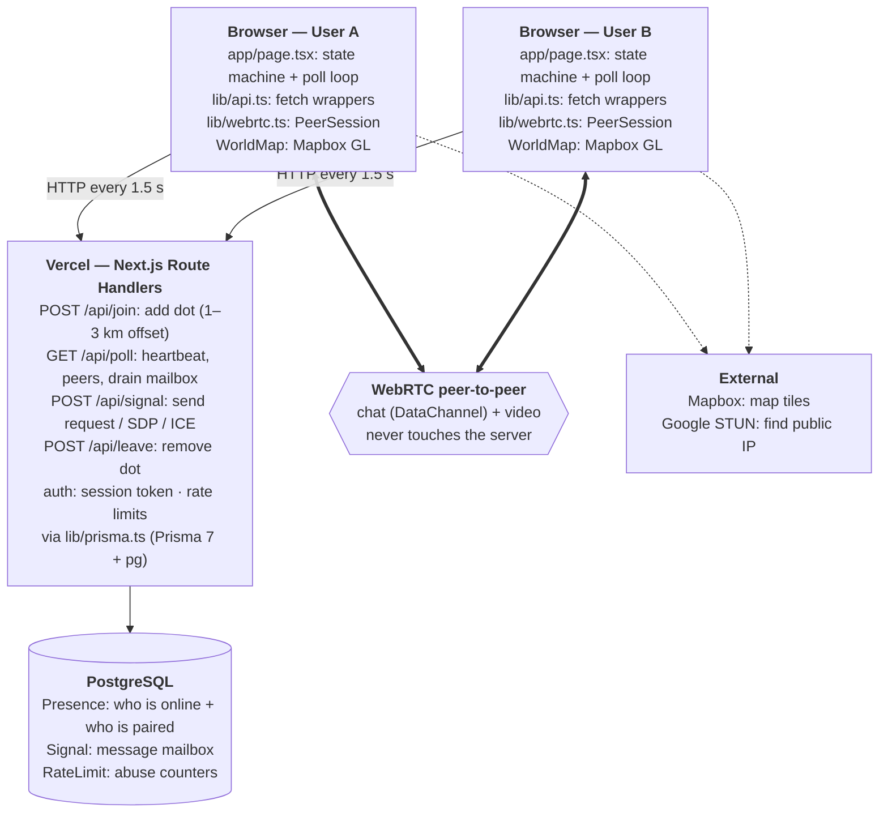
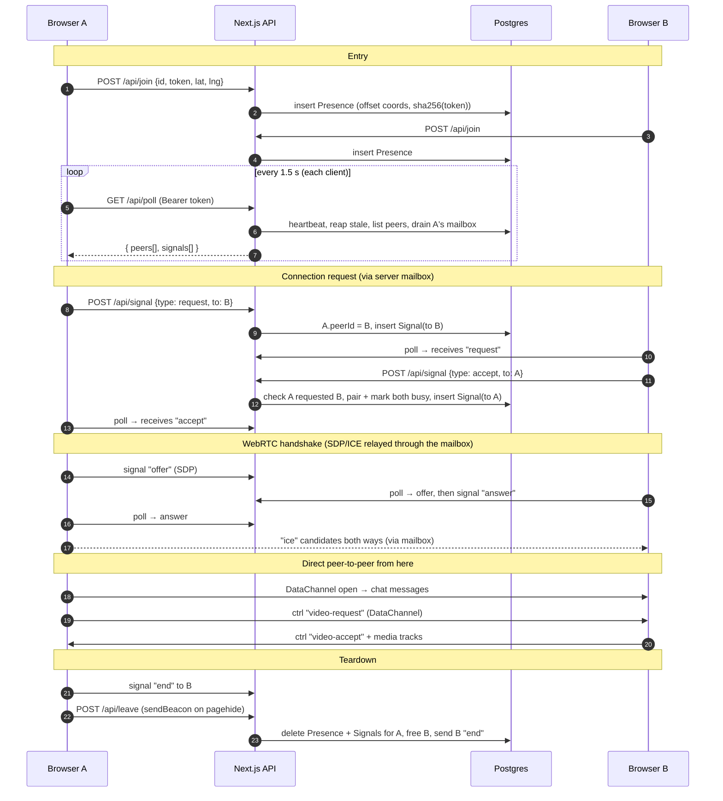

# Pulse — Architecture

## Tech stack

| Layer | Tech |
|---|---|
| Framework | Next.js 16 (App Router), React 19, TypeScript 5 |
| Styling | Tailwind CSS v4 (via `@tailwindcss/postcss`) |
| Map | Mapbox GL JS v3 (`dark-v11` style), loaded client-side only |
| API | Next.js Route Handlers (`app/api/*/route.ts`), Node runtime, `force-dynamic`. Callers are authenticated by a per-tab secret token (`Authorization: Bearer`) |
| Data access | Prisma 7 with the `@prisma/adapter-pg` driver adapter (`pg`) |
| Database | PostgreSQL (Neon / Vercel Postgres); used only for short-lived coordination data |
| Realtime transport | HTTP polling every 1.5 s (no WebSockets, because it runs on Vercel serverless) |
| Peer-to-peer | WebRTC: a data channel for chat and video control messages, media tracks for video. STUN only (Google), no TURN |
| Hosting | Vercel |

## System overview

**Main idea:** the server only handles *coordination*, meaning who is online and relaying the
WebRTC handshake. Chat text and video go directly between the two browsers.

## Connection lifecycle

## Key files

- `app/page.tsx` — the whole client: session id, poll loop, signal handling, connection/video state machines.
- `app/components/*` — UI only (map, prompts, chat, video).
- `lib/api.ts` — thin `fetch` wrappers for the four endpoints, sending the session token.
- `lib/session.ts` — creates the tab's public `id` and secret `token`.
- `lib/auth.ts` — token hashing, session lookup, id/token validation, privacy-offset seed.
- `lib/pairing.ts` — server-side connection state (`peerId` + `busy`); signals must match it.
- `lib/payload.ts` — shape checks for SDP / ICE payloads (server and client).
- `lib/ratelimit.ts` — Postgres-backed rate limits and caps.
- `lib/webrtc.ts` — `PeerSession` class, using the "perfect negotiation" pattern (polite/impolite peers).
- `lib/geo.ts` — privacy offset and lat/lng validation.
- `lib/presence.ts` — timing constants (stale = 15 s, signal TTL = 60 s, poll = 1.5 s).
- `prisma/schema.prisma` — `Presence`, `Signal`, and `RateLimit`.
